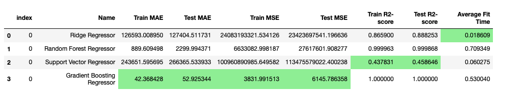

# Bay Area Housing Price Prediction

## Overview
With the given dataset, build an accurate prediction model for housing prices in the Bay Area.
        

        
        

## Directory structure
    ├── data
    │    ├── FinalRedfin.csv
    ├── images
    |    ├── PaintedLadies.png 
    |    ├── ResultDF.png
    ├── HousingPricePrediction.ipynb [Link to notebook](https://github.com/paloorkar1689/CapstoneHousingPricePrediction/blob/main/HousingPricePrediction.ipynb) 

### 1 - Business Understanding
    1.1 Business problem definition
            In the Bay Area housing market, predicting house sale prices is particularly challenging due to 
            houses often selling for prices significantly above their asking prices. 
            This trend is driven by high demand, limited inventory, and competitive bidding among buyers. 
            To build an accurate prediction model with the highest accuracy, it is crucial to consider a range of factors that can influence house prices.
            Factors such as location, square feet, schools, ease of transit, and crime rates can significantly impact the sale price. 
            The goal is to carefully analyse these factors and understand their relative importance, then develop an accurate prediction model.
            This will boost the confidence of buyers to make the right offer and give better insights to real estate investors, sellers as well as agents.

    1.2 Data problem definition
            The data objective is to develop a model that accurately predicts the Sale price for a given house
            This model should also help identify key characteristics that influence success.

### 2 - Data Understanding
    2.1 Data Sources and Collection
        -   Redfin API and CSV consolidation were used to accumulate sold houses in last year in the Bay Area.
        -   FinalRedfin.csv dataset is present in the data folder.
        -   Data will be loaded with pd.read_csv() method of Pandas

    2.2 Data Description
        The cursory overview of the data
	    -	Total 2627 Samples and 24 Features
	    -	Categorical data - 'Unnamed: 0', 'zipOrPostalCode', 'price', 'beds', 'baths', 'squareFeet',
                                'lotSize', 'yearBuilt', 'ppsf', 'latitude', 'longitude', 'walkScore',
                                'bikeScore', 'transitScore', 'rentalValue', 'elementry', 'middle',
                                'high', 'listPrice'
	    -	Numerical data - 'soldDate', 'propertyType', 'address', 'city', 'location'
        -   No duplicate entries.
        -   Price is normally distributed

    2.3 Data Exploration
        ⁃	Checked the describe function to identify the mean and standard deviation
        -   Plotted histograms for all numeric features
        -	Identified outliers values in price, rentalValue, transitScore, lotSize, yearBuilt

    2.4 Data Visualization
        -   Heatmap of co-relations of numeric features.
                rentalValue has the highest positive co-relation
                age and transit-score have a negative co-relation
        -   Bar plot of the number of Sales per month.
                February has the highest number of sales followed by October
        -   Bar plot of Average house prices based on location
                Cupertino and Saratoga are the leading candidate followed by Campbell
        -   Bar plot of Average price by Age range
                Housed built-in 1060s and 1970s have the highest demand
        -   Bar plot Prices vs Zipcode.
                95014 and 95129 have the highest house price
        -   Histograms of all numeric features
                All features are normally distributed with price, rentalValue, transitScore, lotSize, yearBuilt 
                have a lot of outliers.

### 3 - Data Preparation
    3.1 Data Cleaning
        -   Drop Columns that would not provide any information or have a high correlation with other fields.
            -   address, propertyType, Unnamed: 0 has no usefulness hence dropping
            -   City, location, zip code, longitude and latitude have high correlation, dropping city, latitude and longitude. 
            -   Model and Manufacturer are highly correlated, dropping Model
            -   Drop VIN and ID as they do not provide any meaningful information
        -   Drop missing data from the dataset.

    3.2 Remove Outliers
        -   Plotting the histogram of price we understood that price, rentalValue, transitScore, lotSize, and yearBuilt have outliers.
            -   Remove outliers identifying the Q1 and Q3 quantile, deciding the upper and lower bounds
                and drop any data that does not conform to this bound.

    3.3 Feature Engineering
        -   Instead of using year as a parameter, we convert that feature into age by deducting the
            year from the current year. Age can be better interpreted to predict house prices.
        -   zipOrPostalCode converted to String instead of float to use it as a categorical value
        -   Instead of using the listed price directly, calculate the price_diff from the listed vs sold price

    3.4 Feature Selection
        -   Ran PCA for idea feature selection with 0.99 as a threshold
        -   Plotted the Explained variance vs the Number of Principal components
        -   Number of components to keep: 13 out of 17
        -   Dropped 'ppsf', 'yearBuilt', 'location', 'listPrice', 'walkScore', 'bikeScore'

    3.5 Final Features
        -   zipOrPostalCode, beds, baths, squareFeet, lotSize, transitScore, rentalValue, elementry,
            middle, high, age, price_diff_percent and price

### 4 - Modeling
    4.1 Data split
        -   train(70%) and test(30) with train_test_split with random_state=42
        -   Created list for categorical data vs numeric data
    
    4.2 Preprocessors
        -   Created a numeric pipeline with StandardScaler
        -   Created a categorical pipeline with OneHotEncoder
        -   Combined both in preprocessor with ColumnTransformer

    4.3 Ridge Regressor
        -   Create a pipeline with a preprocessor and Ridge Regressor
        -   Define a params_grid 
                'regressor__alpha':  [0.001, 0.01, 0.1, 1.0, 10.0]
        -   Run GridSearchCv with the pipeline and params_grid with scoring as neg_mean_squared_error
        -   Fit the model on the training dataset
        -   Extract and plot the feature importance data 
        -   Store all performance params in resultDf

    4.4 Support Vector Regressor
        -   Create a pipeline with a preprocessor and SVC
        -   Define a params_grid
                'regressor__kernel': ['linear', 'rbf', 'poly'],
                'regressor__C': [0.1, 1, 10],
                'regressor__epsilon': [0.01, 0.1, 1]
        -   Run GridSearchCv with the pipeline and params_grid with scoring as neg_mean_squared_error
        -   Fit the model on the training dataset
        -   Extract and plot the feature importance data 
        -   Store all performance params in resultDf

    4.5 Gradient Boosting Regressor 
        -   Create a pipeline with a preprocessor and Gradient Boosting Regressor
        -   Define a params_grid with    
                'regressor__n_estimators': [50, 100, 200],
                'regressor__learning_rate': [0.05, 0.1, 0.2],
                'regressor__max_depth': [3, 5, 7]
        -   Run GridSearchCv with the pipeline and params_grid with scoring as neg_mean_squared_error
        -   Fit the model on the training dataset
        -   Extract and plot the feature importance data 
        -   Store all performance params in resultDf

    4.6 Random Forest Regressor
        -   Create a pipeline with a preprocessor and Random Forest Regressor
        -   Define a params_grid 
                'regressor__n_estimators': [100, 200, 300],
                'regressor__max_depth': [10, 20, 30],
        -   Run GridSearchCv with the pipeline and params_grid with scoring as neg_mean_squared_error
        -   Fit the model on the training dataset
        -   Extract and plot the feature importance data 
        -   Store all performance params in resultDf

    4.7 Analyze
        -   Calculate train/test MAE, MSE, R2-score.
        -   Identify the mean fit time
        -   Create a data frame to analyze the model performance parameters.
        -   Plot the graphs for permutation importance.

### 5 - Evaluation
    5.1 Overall performance
        -  Gradient Boosting Regressor performed the best with 1396 as Test MAE and 0.99 as R2-score
    
    5.2 Iterative Improvement
        -   Based on the re-runs of the above changes need to be made
            -   Tune hyper parameters for better performance
            -   Observed over fitting, Need to identify highly co-related features and omit them 
                or perform feature engineering to better the prediction. 
            -   Get diverse samples and more relevant features such as crime rate, remodel done to the house, tax info etc.

    5.3 Results
        -   Model Performance
            

            
            

        -   Top 5 important features of Gradient Boosting Regressor and Random Forest Regressor
            -   rental value, elementary, lot-size, squareFeet, age

### 6 - Deployment
    6.1 Strategy
        -  We could Deploy this model as a web application or API to provide users with a user-friendly interface for predicting housing prices in the Bay Area.
        -  The user can provide inputs such as zip code, bath, and beds or he can provide an address of the property. We can use the deployed model to accurately predict
        sale price. 

    6.2 Improvement for Future Predictions
        -   Continuously update the model with new data fetched from recently sold houses inventory from Redfin to improve accuracy and performance. 
        -   Identifying more features such as crime rates, taxes, remodels any major renovations needed, to enhance prediction accuracy.

    6.3 Feature Affecting Pricing
        -   Location: The location of the property is a significant factor affecting housing prices in the Bay Area. Neighborhoods with good school ratings, high transit availability and rental value tend to have higher prices.
        -   Size and Condition: The size and condition of the property, including the number of bedrooms, bathrooms, and overall Square footage play a crucial role in determining its price.

    6.4 Summary
        -   The housing price prediction model for the Bay Area provides a valuable tool for real estate investors, buyers, and sellers to make informed decisions.
        -   By accurately predicting housing prices, the model can help investors identify profitable investment opportunities and sellers determine the optimal listing price for their properties.
        -   Additionally, the model can assist buyers in making informed decisions based on their budget and preferences, ultimately improving the overall efficiency and transparency of the real estate mark
